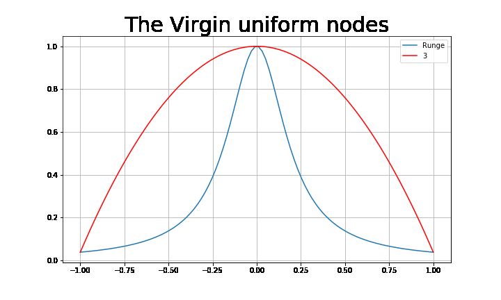
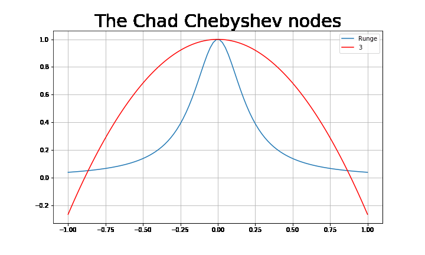

# Computational-math

1. [Overflow-free vector norm](./Vector_norm.ipynb)
2. [Linear Systems solving (Gaussian elimination, Seidel method, and Successive over-relaxation)](./Linear_systems.ipynb)
3. [Polynomial Least squares (Chebyshev, Bernstein and 4 types of standart polynomials)](./Least_squares.ipynb)
4. [Nonlinear systems solving (Fixed-point iteration and Newton's method)](./Nonlinear_systems.ipynb)
5. Interpolation (Lagrange's polynomial and Splines)
6. [Numerical integration (Simpson's rule, Runge's rule)](./Numerical_integration.ipynb)

 

  
 

  
 

  
 

**NB**: I use Russian in notebooks.
